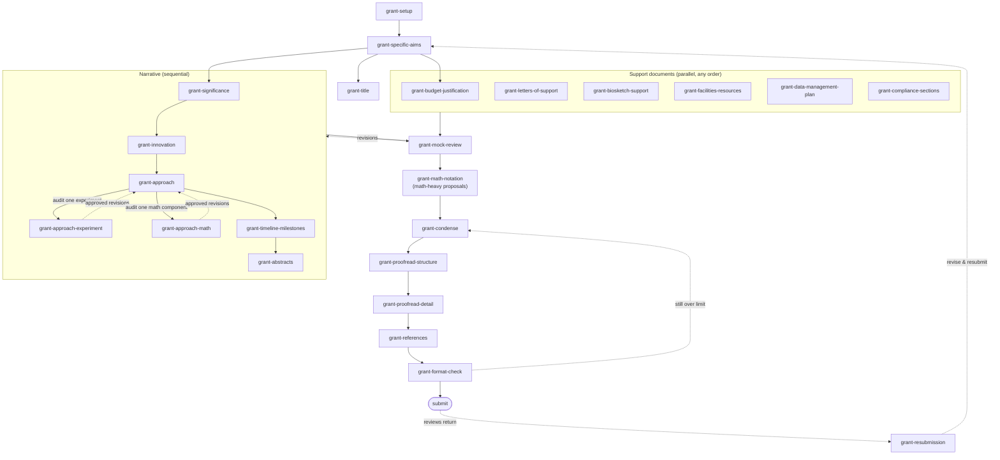

# Grant Writing Skill Suite

A suite of 24 skills covering the full lifecycle of a federal research grant proposal (NIH, NSF, DoD, foundations). Each skill lives in its own directory with a `SKILL.md`.

## Workflow order

| Phase | Skill | Purpose |
|---|---|---|
| 1 | `grant-setup` | Folder structure, FOA ingestion, checklist, config, style profile |
| 2 | `grant-specific-aims` | Aims page drafting and innovation feedback |
| 3 | `grant-title` | Title development after aims stabilize |
| 4 | `grant-budget-justification` | Personnel, line items, justification; syncs aims |
| 5 | `grant-significance` | Significance section |
| 6 | `grant-innovation` | Innovation section |
| 7 | `grant-approach` | Approach, one subsection at a time, rationales first |
| 7a | `grant-approach-experiment` | Deep design review of a single experiment (controls, power, confounds, interpretation) |
| 7b | `grant-approach-math` | Substance review of a single mathematical component (formulation, assumptions, identifiability, proof feasibility) |
| 8 | `grant-letters-of-support` | Early letter drafts for collaborators |
| 9 | `grant-timeline-milestones` | Timeline, milestones, Gantt |
| 10 | `grant-abstracts` | Summary, narrative, lay abstracts |
| 11 | `grant-biosketch-support` | Biosketches, Other Support / Current & Pending |
| 12 | `grant-facilities-resources` | Facilities, equipment, environment docs |
| 13 | `grant-data-management-plan` | NIH DMSP / NSF DMP |
| 14 | `grant-compliance-sections` | Human subjects, vertebrate animals, rigor |
| 15 | `grant-mock-review` | Red-team study section simulation |
| 16 | `grant-math-notation` | Math/LaTeX notation audit for math-heavy proposals (per section or whole document) |
| 17 | `grant-condense` | Cut an over-length draft to the page limit: structural cuts then sentence tightening |
| 18 | `grant-proofread-structure` | High-level flow, missing elements, transitions |
| 19 | `grant-proofread-detail` | Spelling, grammar, figure/table references |
| 20 | `grant-references` | Citation completeness and accuracy |
| 21 | `grant-format-check` | Page limits, fonts, margins, attachments |
| 22 | `grant-resubmission` | Response to reviews, resubmission intro |

Order is a default, not a rule. Budget, letters, and admin documents proceed in parallel with the narrative.

## Workflow diagram

The same ordering as a figure — solid arrows are the default sequence, dashed arrows are loops and feedback. The Mermaid below is the maintained source; a standalone vector version lives at [`../docs/workflow.svg`](../docs/workflow.svg).

## Shared conventions (all skills follow these)

### 1. Project config contract

`grant-setup` creates `00_admin/project-config.md` in the grant folder. **Every other skill reads this file first** and asks the user to run `grant-setup` if it is missing. It records: funder, mechanism, FOA number, deadline, document format (Word/LaTeX), personnel, page limits, versioning schema, and links to the checklist and style profile.

### 2. Interaction tone

All skills use rigorous, neutral scientific language:

- No flattery. Never "this is a great idea," "excellent work," or similar.
- State strengths and weaknesses as facts, in neutral tone, with reasons.
- No filler praise or encouragement. Substance only.
- Disagree directly, with evidence, when the science or strategy warrants it.

### 3. Versioning schema

`<document>_v<NN>_<YYYY-MM-DD>_<status>.<ext>`

- `NN`: zero-padded integer, incremented per editing session, never reused
- `status`: `draft` → `internal` (shared with team) → `shared` (external readers) → `final`
- Never overwrite a version; each session writes a new file
- Example: `specific-aims_v03_2026-07-12_internal.docx`

### 4. Text refinement flow

Refine text interactively in the AI conversation. Only user-approved text is placed into the document files. Skills never silently edit a document the user has not seen.

**Reasoning belongs in the conversation, not the document.** When a skill chooses a method, analysis, statistical approach, or framing, it explains *why* to the researcher in the chat — the researcher needs to understand and vet the choice. But that justification should not automatically become document prose. Reviewers assume competence and read at speed; a paragraph explaining why a standard method was selected wastes page budget and can read as defensive. The document states the choice and includes justification only where a reviewer genuinely needs it — when the choice is non-obvious, contested in the field, or a rigor point the review criteria ask about. Keep the two channels separate: rich reasoning to the person, lean justified text to the file.

### 5. Writing style profile

`grant-setup` ingests prior grants from `99_prior_grants/` into `00_admin/style-profile.md`. All drafting skills read it and recapitulate the researcher's voice.

### 6. Decision log

Skills append significant decisions (scope changes, dropped aims, budget changes) to `00_admin/decision-log.md` with date and rationale, so late-stage skills can detect inconsistencies.

## Agency reference facts — currency

Agency rules change. Facts embedded in these skills were verified July 2026 where possible (NSF PAPPG 24-1 + Supplements NSF 26-200/26-202; NIH simplified review framework effective Jan 2025). Every skill instructs the model to verify limits and requirements against the specific FOA/NOFO and current agency guide before relying on them.

## Testing status

Drafted 2026-07-06. Eval loops (test prompts, baselines, reviewer feedback) deferred to follow-up sessions — recommended first candidates: `grant-specific-aims`, `grant-approach`, `grant-mock-review`.
