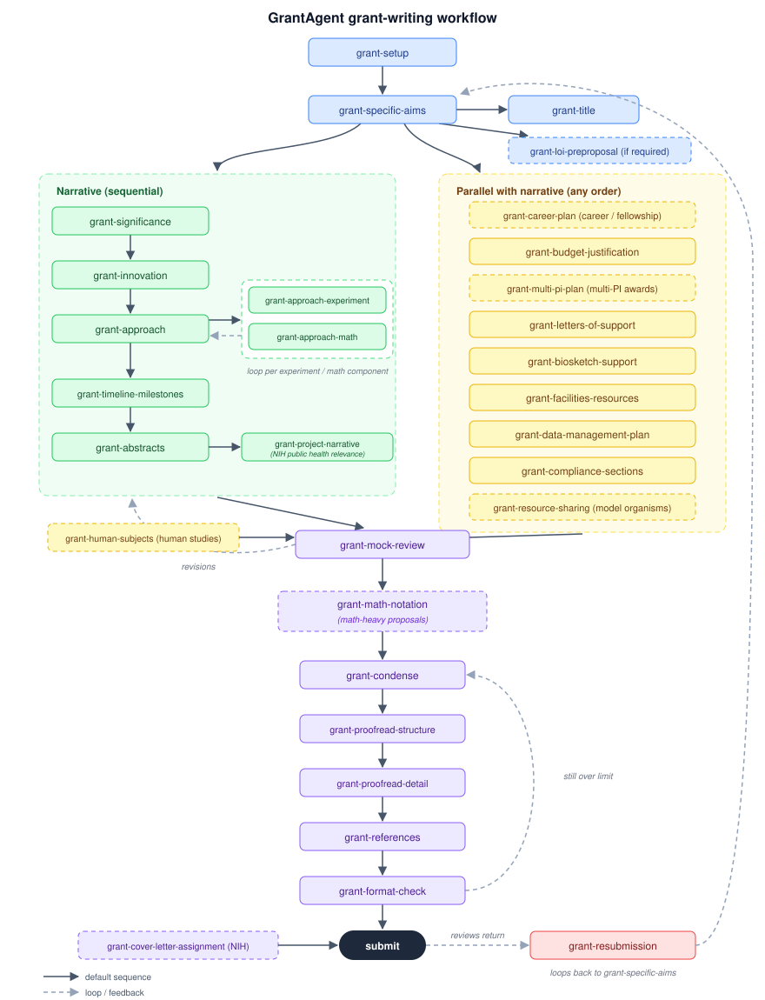

# Grant Writing Skill Suite

A suite of 30+ skills covering the full lifecycle of a federal research grant proposal (NIH, NSF, DoD, foundations). Each skill lives in its own directory with a `SKILL.md`; some ship helper code in a `scripts/` subfolder (e.g., `grant-project-narrative`'s readability checker) alongside the usual `references/`.

## Workflow order

| Phase | Skill | Purpose |
|---|---|---|
| 1 | `grant-setup` | Folder structure, FOA ingestion, checklist, config, style profile |
| 1a | `grant-loi-preproposal` | LOIs, pre-proposals, white papers — administrative notification or first-stage competitive screening |
| 2 | `grant-specific-aims` | Aims page drafting and innovation feedback |
| 2a | `grant-career-plan` | Career awards & fellowships (K, CAREER, F30/F31/F32, GRFP, foundation): training plan, mentor/sponsor team, statements, referee strategy |
| 3 | `grant-title` | Title development after aims stabilize |
| 4 | `grant-budget-justification` | Personnel, line items, justification; syncs aims |
| 4a | `grant-multi-pi-plan` | Multiple PD/PI leadership plan: governance, complementary expertise, PI synergies and history |
| 5 | `grant-significance` | Significance section |
| 6 | `grant-innovation` | Innovation section |
| 7 | `grant-approach` | Approach, one subsection at a time, rationales first |
| 7a | `grant-approach-experiment` | Deep design review of a single experiment (controls, power, confounds, interpretation) |
| 7b | `grant-approach-math` | Substance review of a single mathematical component (formulation, assumptions, identifiability, proof feasibility) |
| 8 | `grant-letters-of-support` | Early letter drafts for collaborators |
| 9 | `grant-timeline-milestones` | Timeline, milestones, Gantt |
| 10 | `grant-abstracts` | Summary and lay abstracts (the abstract family) |
| 10a | `grant-project-narrative` | NIH Project Narrative (public health relevance): plain-language transform, readability-scored |
| 11 | `grant-biosketch-support` | Biosketches, Other Support / Current & Pending |
| 12 | `grant-facilities-resources` | Facilities, equipment, environment docs |
| 13 | `grant-data-management-plan` | NIH DMSP / NSF DMP (data, software, code) |
| 13a | `grant-resource-sharing` | Resource Sharing Plan: model organisms, research tools, materials, MTAs (not data) |
| 14 | `grant-compliance-sections` | Human subjects determination, vertebrate animals, rigor |
| 14a | `grant-human-subjects` | PHS Human Subjects & Clinical Trials form: study records, enrollment, protections, DSMP, protocol synopsis |
| 15 | `grant-mock-review` | Red-team study section simulation |
| 16 | `grant-math-notation` | Math/LaTeX notation audit for math-heavy proposals (per section or whole document) |
| 17 | `grant-condense` | Cut an over-length draft to the page limit: structural cuts then sentence tightening |
| 18 | `grant-proofread-structure` | High-level flow, missing elements, transitions |
| 19 | `grant-proofread-detail` | Spelling, grammar, figure/table references |
| 20 | `grant-references` | Citation completeness and accuracy |
| 21 | `grant-format-check` | Page limits, fonts, margins, attachments |
| 21a | `grant-cover-letter-assignment` | NIH cover letter and PHS Assignment Request: study section targeting, expertise, reviewer exclusions |
| 22 | `grant-resubmission` | Response to reviews, resubmission intro |

Order is a default, not a rule. Budget, letters, and admin documents proceed in parallel with the narrative.

## Workflow diagram

Solid arrows are the default sequence, dashed arrows are loops and feedback. Source: [`../docs/workflow.svg`](../docs/workflow.svg).

## Out of scope

Declared deliberately, so the suite doesn't half-support things and mislead. If a request falls here, skills should say so plainly and point to the right resource rather than improvise.

- **Training and multi-project program grants** — T32/T35 training grants and P01/P50/U54/center mechanisms have a different document architecture (trainee data tables, cross-project cores, program-level narratives) that these single-project skills would get wrong. Individual components (a project within a P01, a biosketch, a budget) can still use the matching skills.
- **Post-award lifecycle** — just-in-time submissions, RPPRs and progress reports, no-cost extensions, prior-approval requests. The suite ends at submission and resubmission.
- **Regulatory documents themselves** — IRB/IACUC protocols, clinical trial registration, DSMB charters. The suite drafts the grant's compliance *sections*; the regulatory submissions belong to the relevant offices and boards.
- **Submission mechanics** — operating ASSIST/Grants.gov/Research.gov/eBRAP and institutional routing. `grant-setup` records who submits and when; the grants office drives the portal.
- **Non-US funders** — ERC, UKRI, Wellcome, and similar have conventions different enough that the embedded guidance would be wrong. Scope is NIH, NSF, DoD, and US foundations.
- **The science** — skills structure, critique, and verify; the researcher originates the ideas and remains the scientific authority throughout.

## Shared conventions (all skills follow these)

### 1. Project config contract

`grant-setup` creates `_agent/project-config.md` in the grant folder. **Every other skill reads this file first** and asks the user to run `grant-setup` if it is missing. A folder with `00_admin/project-config.md` and no `_agent/` is a pre-0.20 layout: read the config there, and follow convention 12 for what to do next. It records: funder, mechanism, FOA number, deadline, document format (Word/LaTeX), storage location (local/Drive/OneDrive/GitHub repo), personnel, page limits, versioning mode, and links to the checklist and style profile.

### 2. Interaction tone

All skills use rigorous, neutral scientific language:

- No flattery. Never "this is a great idea," "excellent work," or similar.
- State strengths and weaknesses as facts, in neutral tone, with reasons.
- No filler praise or encouragement. Substance only.
- Disagree directly, with evidence, when the science or strategy warrants it.

### 3. Versioning schema

Two modes; `project-config.md` records which is in effect.

**Filename mode** (local/Drive/OneDrive storage): `<document>_v<NN>_<YYYY-MM-DD>_<status>.<ext>`

- `NN`: zero-padded integer, never reused; `status`: `draft` → `internal` (shared with team) → `shared` (external readers) → `final`. Example: `specific-aims_v03_2026-07-12_internal.docx`.
- **Versions are checkpoints, not edits.** The highest-numbered file is the *working copy* and is edited in place; a new `NN` is cut only at a **milestone**: a status transition; the file about to leave the team (sent to a co-I, a reader, the grants office — snapshot what they saw); a structural change the PI may want to roll back (an aim dropped, a section removed, a restructuring); or the user asking for a checkpoint. Routine edits — a paragraph revised, a figure swapped, a proofread applied — do not create a version. In real use the per-session rule produced 26 copies of one research narrative at 20 MB each, most differing by a paragraph; the checkpoint rule keeps the folder legible and the history meaningful.
- In-place edits to the working copy are governed by convention 11 (single writer, read-before-write): re-read from disk, check the fingerprint and lock file, keep the rolling pre-write backup.
- Files at `internal`, `shared`, or `final` status are immutable snapshots — never edited. Only the working `draft` (or the working copy of the current status) is edited in place, and the date in its filename is updated to the last edit date when it is renamed at the next checkpoint.
- Drive/OneDrive/SharePoint keep file-level version history automatically, so in-place edits there lose nothing; on a purely local folder without backup, recommend more frequent checkpoints or git.
- `_agent/version-log.md` records every editing session (file, date, one-line summary) whether or not a checkpoint was cut, so the history of in-place edits is still legible.
- `project-config.md` records the `Checkpoint policy`: `milestone` (default, above) | `per-session` (the old behavior, for PIs who want it) | `per-edit` (never recommended; offered so the choice is explicit).
- Large documents: when figures are embedded, each checkpoint copies them. Keep figure source files in a `figures/` subfolder beside the document and move superseded checkpoints to `_archive/` within the same folder so the working directory shows only the live copy and the last checkpoint.

**Git mode** (GitHub repo storage — common for computational faculty writing NSF proposals in LaTeX): stable filenames, one commit per editing session with a descriptive message, status transitions marked with annotated tags (or the team's branch/PR convention). No `version-log.md` — git history serves that role; the decision log is still kept. Where any skill says "new version per the schema," read that as: in filename mode, edit the working copy and cut a checkpoint only if the change is a milestone under the checkpoint policy; in git mode, a commit (plus a tag on status change). Never rewrite pushed history.

### 4. Text refinement flow

Refine text interactively in the AI conversation. Only user-approved text is placed into the document files. Skills never silently edit a document the user has not seen.

**Reasoning belongs in the conversation, not the document.** When a skill chooses a method, analysis, statistical approach, or framing, it explains *why* to the researcher in the chat — the researcher needs to understand and vet the choice. But that justification should not automatically become document prose. Reviewers assume competence and read at speed; a paragraph explaining why a standard method was selected wastes page budget and can read as defensive. The document states the choice and includes justification only where a reviewer genuinely needs it — when the choice is non-obvious, contested in the field, or a rigor point the review criteria ask about. Keep the two channels separate: rich reasoning to the person, lean justified text to the file.

### 5. Writing style profile

`grant-setup` builds `_agent/style-profile.md` from a corpus of the researcher's writing (template: `grant-setup/references/style-profile-template.md`); every skill that produces document prose applies it to each sentence and, before delivering drafted or revised text, checks the output against the profile's closing *Directives* list item by item, counting any punctuation the profile constrains. The profile is the **only** carrier of voice between sessions — the corpus is read once and the model remembers nothing between chats — so it must carry paragraph-scale verbatim exemplars per register (models imitate prose, not adjectives) and checkable directives, with a portable core (voice) kept separate from a project layer (vocabulary, reviewer history, proofread sweep list) so the next proposal can import the core. Letters of support and mentor/sponsor statements are the exception: they are in their signers' voices, and the profile serves there only as a list of PI habits that must not leak in. The profile needs *voice*, not unpublished ideas, so the default recommended source is already-public writing — published papers, review articles, public grant text (RePORTER funded abstracts, awarded NSF abstracts) — which carries the voice while exposing nothing unpublished. Prior/unpublished grants are the user's choice, offered with a plain data-path note: files read by the suite are transmitted to and processed on Anthropic's servers and retained for a window, and *may* be used to improve future models depending on the account — not on commercial plans (Team/Enterprise/API/Gov) by default, and on consumer plans (Free/Pro/Max) only when the model-improvement setting is on. Independent of training, the transmission itself is the consideration for embargoed/confidential/IP material and for institutional AI-use policies. `grant-setup` records the chosen source and any confidentiality constraint in the config; agency and vendor policies change, so it points the user to Anthropic's current privacy settings to confirm.

### 6. Decision log

Skills append significant decisions (scope changes, dropped aims, budget changes) to `_agent/decision-log.md` with date and rationale, so late-stage skills can detect inconsistencies. The log records *why things changed* and is append-only; open work lives in the tracker (convention 9) — a decision that creates work spawns tracker items referencing it, and closing those items never touches the log.

### 7. Suite version stamp

`grant-setup` records the installed plugin version (read from the plugin's own `.claude-plugin/plugin.json`) in `project-config.md` with the date. The config carries a session-start rule instructing every later session to compare the installed version against the recorded one and, on mismatch, append the upgrade to the version history with date and context plus a decision-log entry. The detection logic deliberately lives in the config, not in each skill body — every skill reads the config first, so the rule executes without every skill restating it. Combined with git tags on the repository (one per release), this lets a researcher or a future session know — and retrieve — the exact suite version that shaped an application, which matters most for revisions long after submission.

### 8. Applicant originates the ideas; the suite assists

NIH policy ("Apply Responsibly," [NOT-OD-25-132](https://grants.nih.gov/grants/guide/notice-files/NOT-OD-25-132.html), effective for the September 25, 2025 receipt date; [announcement](https://grants.nih.gov/news-events/nih-extramural-nexus-news/2025/07/apply-responsibly-policy-on-ai-use-in-nih-research-applications-and-limiting-submissions-per-pi)): applications "either substantially developed by AI or containing sections substantially developed by AI are not considered the original ideas of applicants and will not be considered." The same expectation of original authorship holds across funders even where it is not yet written into policy. The scientific ideas — the problem, the hypotheses, the aims, the experimental design — must originate with the researcher.

The suite therefore collaborates on *expression*, not on *ideas*. This matters most in the four idea-bearing narrative sections — `grant-specific-aims`, `grant-significance`, `grant-innovation`, `grant-approach` — which carry the intellectual content reviewers judge as the applicant's own. All drafting skills, and those four especially, must:

- **Elicit before drafting.** Draw out the researcher's own problem, gap, aims, hypotheses, novelty claims, and design first. Do not invent them. Where the researcher has no answer, ask questions and offer options for them to react to and choose among — framed as prompts for their judgment, not a finished scientific direction handed over for approval.
- **Structure and stress-test, don't supply.** Organize an argument the researcher provides, tighten prose in their voice, surface gaps and counterarguments, assess novelty against the literature. That is editorial and analytical work on their material — not generation of the intellectual content.
- **Keep the researcher the author of record.** Text enters a document only after they have read, edited, and approved it (convention 4), so the wording is one they have made their own.
- **Do not paper over a thin idea.** When a section is weak because the underlying science is thin, say so and send the researcher back to the science — never manufacture novelty or significance to fill the space.

This is a boundary the skills enforce *toward the user*, in the same spirit as the neutral-tone rule (convention 2): assistance stays on the writing side of the line the funder draws. Verify the policy against the current FOA and agency guide before relying on specifics — agency rules on AI are tightening. (NIH notice checked July 2026.)

### 9. Work tracker

`grant-setup` creates `_agent/tracker.md` — **exactly one per grant**, never per skill and never per document — and registers it in `project-config.md` (`Tracker:` field), which is the only discovery a session needs. The tracker is the suite's shared TODO list: document status, open work items, deferred fixes, and cross-section ripples, organized under per-document headings with sequential IDs (`T-001`, …) that are never reused; resolved items move to a Resolved table rather than being deleted. One file, because ripple items are inherently cross-document — a budget cut touches the aims page, timeline, and abstract, and a single tracker gives one place to log it and one place to look. Per-skill or per-document trackers would fragment exactly the state that must be shared. (Template: `grant-setup/references/tracker-template.md`.)

The tracker exists to fix two session-level failure modes: findings rehashed every session, and work lost at session boundaries. Its operating rules ride in the `project-config.md` template — the same pattern as convention 7, since every skill reads the config first, the rules execute without each skill restating them:

- A session works only the section/document the user names. At session start it reads the tracker and presents the active document's open items as the working checklist.
- An issue found *outside* the active section is logged, not discussed — after checking it isn't already there (an item already logged is never re-raised). Conceptual/ripple findings are logged silently, with at most a one-line acknowledgment; minor mechanical findings (spelling, acronym drift) are logged and the user asked once: fix now or later.
- The tracker is updated at the moment an item is found, resolved, or changed — never batched to session end. An interrupted session then loses nothing, and the user never has to announce a handoff for state to be recorded.

Division of labor: the decision log answers "why did this change?"; the tracker answers "what is still open?". Reports (mock review, audits, proofreads in `_agent/reports/`) hold the full findings; the tracker holds only the open action items they generate, each pointing back to its origin.

### 10. Session orientation file (`CLAUDE.md`)

`grant-setup` writes a `CLAUDE.md` at the grant folder root (template: `grant-setup/references/claude-md-template.md`) and records it in `project-config.md` (`Session orientation:` field). It is the one file Claude reads *before* the first message of a session, which makes it the only place where "read the config, the style profile, and the tracker first" executes without depending on a skill firing. Conventions 1, 5, 7, and 9 all assume a skill has loaded and obeyed its opening instruction; a fresh chat opened in the grant folder has no skill loaded, and in real use this produced sessions that edited documents directly, in default voice, with the config never read. The file names the session-start reads, carries a task-to-skill routing table so requests go through the skills rather than around them, and states the voice and tone rules from turn one. It orients and points to `_agent/`; it does not duplicate the config, so per-grant facts still live in one place. The user must open or connect the grant's own folder as the project — a parent folder holding several grants will not reliably load a `CLAUDE.md` two levels down.

### 11. Single writer, read-before-write

Grant documents have two writers: the researcher in Word (or Overleaf), and the model editing the file directly. Real use produced the failure this convention prevents — a session wrote a Word file from its in-context picture of an earlier read while the user had since re-saved it in Word and inserted Zotero citations; the package structure and every citation number after the insertions had changed, and the write overwrote the user's work. Nothing had told the session to re-read, to notice the file had changed, or to stay out of the reference manager's way. The rules ride in the `project-config.md` template (convention-7 pattern) so every skill obeys them:

- **Read from disk immediately before every write, and derive edits from that read** — never from an earlier read in the conversation. Express edits as anchored operations on current content (find this sentence, change it to this); if an anchor is not found, stop and report rather than guess.
- **Fingerprint every read and log every write.** A fingerprint is size, modification time, paragraph count, and for Word the package part count and citation-field count. Before writing, compare the file to the fingerprint the session holds; on mismatch, stop, tell the user what changed, and re-derive from the current file. After writing, log the post-write fingerprint in `_agent/version-log.md` (git mode: the commit hash) so the next session detects edits made between sessions at its first read, not mid-task.
- **Lock-file check.** Word writes a hidden `~$<name>.docx` owner file while a document is open (LibreOffice `.~lock.<name>#`; Overleaf has no lock — ask). If it exists, the document is open: do not write. Deliver the changes as an anchored change list for the user to apply, or wait until the user says the file is closed.
- **Rolling pre-write backup.** Before an in-place write, copy the current file to `_archive/<document>.pre-write.bak` in the same folder, overwriting the previous backup — one file, not a version per edit. A bad write is then one copy from recoverable on any storage.
- **Announce the handoff, both ways.** After writing, say so and state that edits the user now makes in Word become the new truth. When the user says they edited a document, re-read it in full before anything else; never ask them to describe their edits from memory.
- **Reference-manager boundary** (`grant-references`): the model never writes Zotero/EndNote/Mendeley field codes and never types formatted citation text into the document. It may insert the PI's recorded placeholder convention (e.g., `(PMID: 12345678)`) into the text — under all rules above — and otherwise delivers a citation worklist the user executes in Word. It never refers to a citation by number across an edit boundary; numbers change on every insertion. Anchor to the sentence and, for fielded citations, the CSL item ID.

Setup asks who edits the documents and how, records the editing protocol in the config, and tells the user the two habits that keep the file safe: close it in Word before asking for a write, and say when they have edited it.

### 12. File placement (`_agent/` for AI files)

*A file goes where the person who needs it will look for it, and files only the AI needs go under `_agent/`.* The first real application ended with 42 markdown files spread across the folders — human admin documents buried among AI logs in `00_admin/`, figure sources in the admin folder, audit reports where the submission package should have been — because no rule said where files go. Full placement table and the pre-0.20 migration mapping: `grant-setup/references/layout.md`. The short form: config, profile, tracker, logs, FOA summary → `_agent/`; working notes → `_agent/notes/`; pre-approval section drafts → `_agent/drafts/<component>/`; every review and audit report → `_agent/reports/`; human admin documents (FOA PDFs, office checklist, submission forms) → `00_admin/`; submitted documents → their numbered component folder with `_archive/` for superseded checkpoints; figures → `<component>/figures/` (inserted file), `figures/src/` (source), `preliminary_data/<aim>/` (the analysis, with its `RUNBOOK.md` — the one markdown file allowed outside `_agent/`); `08_final_assembly/` → only the upload package under the funder's attachment names. `_agent/` sits outside the numbered sequence on purpose: visible in Finder and OneDrive (unlike a dot-folder), sorted first, and clearly not a submission component.

Pre-0.20 folders (`00_admin/project-config.md`, no `_agent/`): read the config where it is, write new AI files under `_agent/`, record `Layout: legacy`, and offer the migration in `layout.md` — never migrate a folder the user has declared final.

## Agency reference facts — currency

Agency rules change. Facts embedded in these skills were verified July 2026 where possible (NSF PAPPG 24-1 + Supplements NSF 26-200/26-202; NIH simplified review framework effective Jan 2025). Every skill instructs the model to verify limits and requirements against the specific FOA/NOFO and current agency guide before relying on them.

## Authoring guidance (for maintaining these skills)

- **Triggering is everything.** The agent sees only each skill's name and description when deciding whether to load it — the body loads afterward. Descriptions must name the phrases users actually type ("biosketch," "pink sheets," "poke holes in this"), not just describe the content. Slightly pushy phrasing ("use whenever the user mentions…") outperforms neutral, because agents under-trigger.
- **Keep SKILL.md lean; push detail to references.** The body costs context every time the skill fires. Workflow belongs in the body; lookup material (agency criteria, checklists, variants) belongs in `references/` files read only when needed. Explain *why* rules exist rather than stacking MUSTs — models follow reasoning better than commandments.
- **Shared state, not shared context.** Sessions don't remember each other; `project-config.md`, the decision log, the tracker, and the notation registry are what carry decisions across sessions. When adding a skill, ask what durable state it should read and write — and route any open work it discovers into the tracker rather than leaving it in conversation.
- **Test with realistic prompts.** Run 2–3 prompts phrased the way researchers actually type (typos, shorthand included), compare against no-skill output, and fix what generalizes — not what is specific to one test.
- **Fold repeated corrections into the skill.** If a user corrects the agent the same way twice, that correction belongs in SKILL.md, not in every future conversation.

## Testing status

Drafted 2026-07-06. Eval loops (test prompts, baselines, reviewer feedback) deferred to follow-up sessions — recommended first candidates: `grant-specific-aims`, `grant-approach`, `grant-mock-review`.
